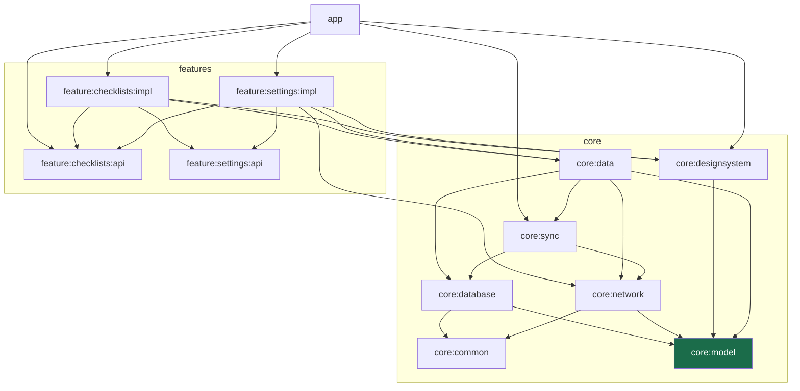

# CleanArchWithAgent

A production-ready Android starter template: multi-module Clean Architecture, offline-first sync that
actually works without a server, and AI-agent instructions that live in the repository.

> **Demo GIF goes here.** Record the offline round trip: create a checklist → switch the network
> simulator to Offline → add items and watch the badges turn to *pending* → switch back to Normal →
> watch them turn *synced*. Save it as `docs/demo.gif` and replace this block with
> ``.

## Why this exists

Most Android samples show one of these things well. Assembling all of them — module boundaries that
hold, an offline-first sync engine, a build that scales, tests that run without an emulator — is a
week of work before you write a line of your own feature.

This template is that week, already done:

- **It runs with no backend.** A fake in-app server and a network simulator ship with it, so you can
  see offline-first behaviour on a fresh clone with nothing else installed.
- **The architecture is enforced, not just described.** No feature module can see another feature's
  implementation, because the dependency graph makes it impossible — not because a document asks
  nicely.
- **It is meant to be read.** Comments explain *why*, not what. Where something is non-obvious
  (AGP 9's DSL, a conflict rule, a Robolectric workaround) the reasoning is written down next to the
  code.

## Architecture

Dependencies point inward. Nothing in an inner ring knows the rings outside it.



Note what is *not* there: no arrow between `feature:checklists:impl` and `feature:settings:impl`.
They navigate to each other — in both directions — through `api` modules that contain a route string
and nothing else. `app` is the only module that sees any `impl`.

`core:model` (highlighted) is pure Kotlin with no Android dependency at all, which is what lets the
domain models be tested on the JVM in milliseconds.

Verify any of this yourself:

```bash
./gradlew :feature:settings:impl:dependencies --configuration debugCompileClasspath | grep feature
```

## Quick start

Needs JDK 21 and the Android SDK. Nothing else — no server, no API keys, no `local.properties`
editing.

```bash
git clone <this-repo-url>
cd CleanArchWithAgent
./gradlew build test          # ~2.5 minutes cold, 70 tests
```

Then open the project in Android Studio and run the `app` configuration, or:

```bash
./gradlew :app:installDebug
```

The app starts with an empty checklist screen. Create a checklist, open it, add some items.

**To see the point of the template**, go to Settings (gear icon) → set the network simulator to
**Offline** → go back and edit some checklists → watch each row's badge turn to *pending* and the top
bar show a pending count → return to Settings and switch back to **Normal** → watch everything turn
*synced*.

## Key design decisions

**Room is the single source of truth.** The UI observes Flows from the database and never reads a
network response directly. This is what makes the app work identically offline and online — there is
no "loading from network" path to get wrong.

**Local writes and the outbox are one transaction.** A write puts the row and its outbox entry in the
database atomically. If only the row landed, the edit would never reach the server; if only the
outbox entry did, the user would not see their own edit. A test asserts the rollback.

**Every outbox operation has a stable ID.** The client cannot distinguish "the server never got it"
from "the server got it and the response was lost", so it retries. The operation ID lets the server
recognise the replay and return the original result instead of applying the change twice.

**A remote change never silently overwrites a pending local one.** Last-write-wins on a timestamp,
*except* when the local record still has unpushed work — then the local version is kept and the
record is flagged `CONFLICT`. Your own typing never disappears because a sync happened to land.

**Push and pull are attempted independently.** An early version aborted the whole pass when a push
failed, which meant a device that could not push would never learn about remote changes, and so would
never detect a conflict — exactly when noticing one matters most. A test caught it.

**A change is abandoned after 5 failed pushes.** It is marked `FAILED` and dropped from the outbox.
Operations push oldest-first, so without this one permanently unpushable change would block
everything behind it forever. The record stays on the device and visible.

**`api` / `impl` module pairs.** A feature's `api` module holds its navigation route and nothing
else. Features depend on each other's `api` only, so a feature can be rewritten or removed without
touching any other.

**Navigation assembles itself.** Each feature binds a `FeatureNavigation` into a Hilt `@IntoSet`
multibinding; `app` injects the `Set` and names no individual feature. Adding a feature means adding a
module — there is no central list to forget to update.

**Tests use fakes, not mocks.** Fakes behave like the real thing, so tests assert on outcomes rather
than on which methods got called. Database and sync tests drive a real in-memory Room instance,
because the guarantees under test *are* transaction behaviour — a mocked DAO would only test the
mock.

## The network simulator

The app talks to `FakeNetworkDataSource`, an in-memory stand-in that honours the same idempotency
contract a real server would. `NetworkSimulator` sits in front of it with four modes, switchable at
runtime from the settings screen:

| Mode | Behaviour | Use it to see |
|---|---|---|
| **Normal** | Succeeds after ~150 ms | The happy path |
| **Slow** | Succeeds after ~3 s | Loading and syncing states |
| **Flaky** | Fails ~50% of calls | Retry and exponential backoff |
| **Offline** | Every call fails | Edits queueing, then draining when you return |

Failures are thrown as `IOException`, so nothing above the simulator can tell the fake from a real
transport failure.

To point the template at a real backend, set a base URL and swap one binding in
`core/network/.../di/NetworkModule.kt` — `RetrofitNetworkDataSource` is already written.

## Using the AI skill

The repository ships instructions for coding agents:

- **`CLAUDE.md`** — architecture, the rules that must not be broken, commands, and the build
  constraints that are non-obvious (AGP 9's DSL differs from every AGP 8 example online).
- **`.claude/skills/new-feature-module/`** — a skill that walks an agent through adding a feature.

In [Claude Code](https://claude.com/claude-code):

```
/new-feature-module inspections
```

It creates the `api` and `impl` modules with the convention plugins, a ViewModel with immutable UI
state, a passing test, and the navigation multibinding — then verifies the module boundary rule and
runs `./gradlew build test`.

The skill was tested by generating a throwaway feature, confirming the build passed, and deleting it.

## Tech stack

Kotlin · Jetpack Compose (Material 3) · Coroutines and Flow · Hilt · Room · WorkManager · Retrofit +
OkHttp + kotlinx.serialization · Navigation Compose · JUnit4 · Turbine · Robolectric · KSP throughout
(no kapt).

Built with AGP 9 and Gradle 9. `minSdk` 26, `targetSdk` 36, `compileSdk` 37. All versions live in
`gradle/libs.versions.toml` with comments explaining the non-obvious constraints.

## Testing

```bash
./gradlew test    # 70 JVM tests, no emulator needed
```

DAO and Compose UI tests run on Robolectric, so the whole suite runs in CI without a device. The
instrumented smoke tests in `app/src/androidTest/` need an emulator:

```bash
./gradlew :app:connectedDebugAndroidTest
```

CI runs build, unit tests and lint on every pull request.

## Roadmap

Deliberately not in v1, in rough order of usefulness:

- [ ] **Conflict-resolution UI.** v1 keeps the local version and flags it; there is no screen yet to
      compare and choose.
- [ ] **Photo attachments** with a separate upload queue, since binary uploads do not fit the outbox
      model cleanly.
- [ ] **A real backend**, to replace the in-app fake.
- [ ] **Macrobenchmark module and baseline profiles.**
- [ ] **Fastlane release lanes.**
- [ ] **Migration tests on-device**, to complement the Robolectric DAO tests.

## Licence

Not yet chosen. Until one is added, this is all-rights-reserved by default — if you want to use it,
open an issue and ask.

## Contributing

Read `CLAUDE.md` first: it documents the rules the architecture depends on. A pull request that puts
a feature's `impl` on another feature's classpath, or an Android dependency into `core:model`, will
be asked to change regardless of how well it works.
