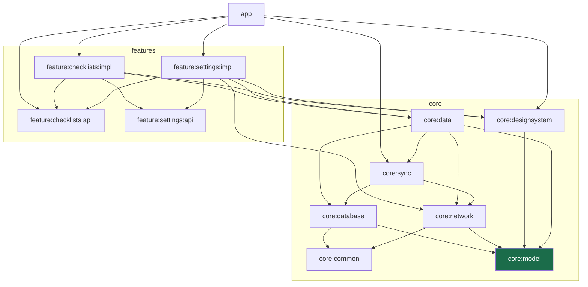
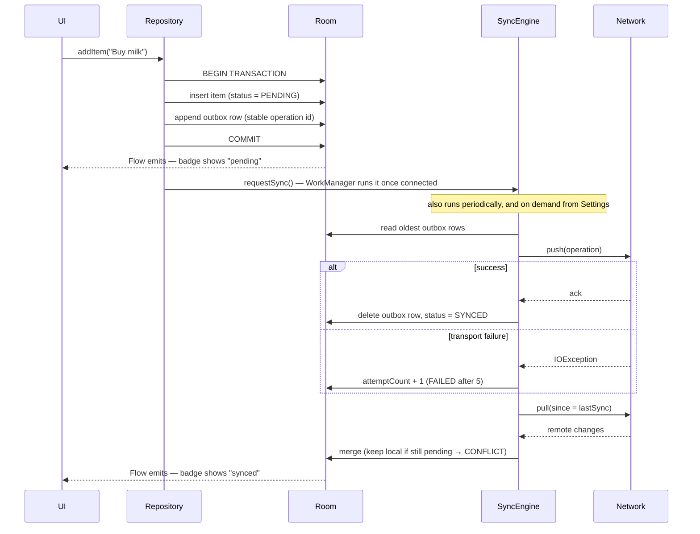

<div align="center">

# CleanArchWithAgent

**A production-ready Android starter template.**
Multi-module Clean Architecture · Offline-first sync that works without a server · AI-agent instructions that live in the repo

[](https://github.com/spoonart1/cleanarch-with-agents/actions/workflows/ci.yml)


</div>

> **Demo GIF goes here.** Record the offline round trip: create a checklist → switch the network
> simulator to Offline → add items and watch the badges turn to *pending* → switch back to Normal →
> watch them turn *synced*. Save it as `docs/demo.gif` and replace this block with
> ``.

---

## Table of contents

1. [Why this exists](#-why-this-exists)
2. [Quick start](#-quick-start)
3. [See it work offline](#-see-it-work-offline)
4. [Architecture](#-architecture)
5. [Project layout](#-project-layout)
6. [How a write reaches the server](#-how-a-write-reaches-the-server)
7. [Key design decisions](#-key-design-decisions)
8. [The network simulator](#-the-network-simulator)
9. [Testing](#-testing)
10. [Working with a coding agent](#-working-with-a-coding-agent)
11. [Tech stack](#-tech-stack)
12. [Roadmap](#-roadmap)
13. [Contributing](#-contributing)
14. [Licence](#-licence)

---

## 🎯 Why this exists

Most Android samples show *one* of these things well. Assembling all of them — module boundaries that
hold, an offline-first sync engine, a build that scales, tests that run without an emulator — is a
week of work before you write a line of your own feature.

This template is that week, already done.

| | What you get |
|---|---|
| 🔌 **Runs with no backend** | A fake in-app server and a network simulator ship with it. Clone, build, and see offline-first behaviour with nothing else installed. |
| 🧱 **Architecture is enforced, not described** | No feature module can see another feature's implementation, because the dependency graph makes it impossible — not because a document asks nicely. |
| 📖 **Meant to be read** | Few comments by design; names and structure carry the meaning. Where something genuinely is non-obvious (AGP 9's DSL, a conflict rule, a Robolectric workaround) the reasoning is written down next to the code or in `CLAUDE.md`. |
| 🤖 **Agent-ready** | `CLAUDE.md`, conventions, four scoped agents and two skills are committed, so a coding agent that clones the repo already knows the rules. |

---

## 🚀 Quick start

**Requirements:** JDK 21 and the Android SDK. Nothing else — no server, no API keys, no
`local.properties` editing.

```bash
git clone https://github.com/spoonart1/cleanarch-with-agents.git
cd cleanarch-with-agents
./gradlew build test          # ~2.5 minutes cold
```

Then open the project in Android Studio and run the `app` configuration, or install from the CLI:

```bash
./gradlew :app:installDebug
```

The app starts with an empty checklist screen. Create a checklist, open it, add some items.

---

## 📴 See it work offline

This is the point of the template. Do it once before reading any code.

| Step | Where | What you see |
|:---:|---|---|
| 1 | Home screen | Create a checklist and add a few items. Each row shows a **synced** badge. |
| 2 | Settings (gear icon) | Set the network simulator to **Offline**. |
| 3 | Back to a checklist | Edit or add items. Badges turn to **pending**, and the top bar shows a pending count. |
| 4 | Settings | Switch back to **Normal**. |
| 5 | Back to the list | Everything turns **synced**. Nothing was lost, nothing was duplicated. |

Try **Flaky** instead of Offline to watch retries and backoff, or **Slow** to see loading states.

---

## 🏛 Architecture

Dependencies point inward. Nothing in an inner ring knows the rings outside it.



Three things to notice:

- **No arrow between the two `impl` modules.** Features navigate to each other — in both
  directions — through `api` modules that contain a route string and nothing else. `app` is the only
  module that sees any `impl`.
- **`core:model` (highlighted) is pure Kotlin.** No Android dependency at all, which is what lets the
  domain models be tested on the JVM in milliseconds.
- **Room is the single source of truth.** The UI observes Flows from the database and never reads a
  network response directly.

Verify the module boundary yourself — the output should list `api` modules only:

```bash
./gradlew :feature:settings:impl:dependencies --configuration debugCompileClasspath | grep feature
```

### The rules that must not be broken

| # | Rule | Why |
|:---:|---|---|
| 1 | No feature depends on another feature's `impl` | A feature can be rewritten or removed without touching any other |
| 2 | `core:model` has no Android dependency | Domain models stay testable without an emulator |
| 3 | `app` stays thin: wiring and navigation only | Business logic in `app` is invisible to every module test |
| 4 | Never swallow `CancellationException` | A bare `catch (e: Exception)` around a suspending call breaks structured concurrency |
| 5 | Fakes over mocks | Tests assert on outcomes, not on which methods got called |
| 6 | Every multi-table write is one transaction | Half-written state is the root of most sync bugs |

---

## 🗂 Project layout

```
CleanArchWithAgent/
├── app/                        Thin shell: Application, MainActivity, NavHost
├── feature/
│   ├── checklists/
│   │   ├── api/                Route key only
│   │   └── impl/               List and detail screens, ViewModels, navigation multibinding
│   └── settings/
│       ├── api/
│       └── impl/               Network simulator switch and manual sync trigger
├── core/
│   ├── model/                  Pure Kotlin domain models (no Android)
│   ├── common/                 Clock and coroutine dispatchers, injectable so tests control both
│   ├── database/               Room: entities, DAOs, the outbox table
│   ├── network/                NetworkDataSource contract, Retrofit impl, in-app fake + simulator
│   ├── sync/                   SyncEngine, WorkManager worker and scheduler, sync status monitor
│   ├── data/                   Offline-first repository the features depend on
│   ├── designsystem/           Theme, colours, sync badge, loading/empty/error views
│   └── testing/                Shared fakes, sample data and test rules
├── build-logic/                Convention plugins (one per module type)
├── tools/detekt-rules/         Custom detekt rules: boolean naming, test naming
├── config/detekt/              detekt.yml with a comment on every deviation
├── gradle/libs.versions.toml   Every version, with the reasoning behind the pinned ones
├── .claude/                    Agent instructions, conventions, agents, skills
└── CLAUDE.md                   The rules, the commands, and the AGP 9 gotchas
```

---

## 🔄 How a write reaches the server



The UI never waits on the network. It observes Room, and Room changes when the sync engine says so.

---

## 🧠 Key design decisions

<details open>
<summary><strong>Room is the single source of truth</strong></summary>

The UI observes Flows from the database and never reads a network response directly. This is what
makes the app work identically offline and online — there is no "loading from network" path to get
wrong.
</details>

<details>
<summary><strong>Local writes and the outbox are one transaction</strong></summary>

A write puts the row and its outbox entry in the database atomically. If only the row landed, the
edit would never reach the server; if only the outbox entry did, the user would not see their own
edit. A test asserts the rollback.
</details>

<details>
<summary><strong>Every outbox operation has a stable ID</strong></summary>

The client cannot distinguish "the server never got it" from "the server got it and the response was
lost", so it retries. The operation ID lets the server recognise the replay and return the original
result instead of applying the change twice.
</details>

<details>
<summary><strong>A remote change never silently overwrites a pending local one</strong></summary>

Last-write-wins on a timestamp, *except* when the local record still has unpushed work — then the
local version is kept and the record is flagged `CONFLICT`. Your own typing never disappears because
a sync happened to land.
</details>

<details>
<summary><strong>Push and pull are attempted independently</strong></summary>

An early version aborted the whole pass when a push failed, which meant a device that could not push
would never learn about remote changes, and so would never detect a conflict — exactly when noticing
one matters most. A test caught it.
</details>

<details>
<summary><strong>A change is abandoned after 5 failed pushes</strong></summary>

It is marked `FAILED` and dropped from the outbox. Operations push oldest-first, so without this one
permanently unpushable change would block everything behind it forever. The record stays on the
device and visible.
</details>

<details>
<summary><strong><code>api</code> / <code>impl</code> module pairs</strong></summary>

A feature's `api` module holds its navigation route and nothing else. Features depend on each
other's `api` only, so a feature can be rewritten or removed without touching any other.
</details>

<details>
<summary><strong>Navigation assembles itself</strong></summary>

Each feature binds a `FeatureNavigation` into a Hilt `@IntoSet` multibinding; `app` injects the
`Set` and names no individual feature. Adding a feature means adding a module — there is no central
list to forget to update.
</details>

<details>
<summary><strong>Tests use fakes, not mocks</strong></summary>

Fakes behave like the real thing, so tests assert on outcomes rather than on which methods got
called. Database and sync tests drive a real in-memory Room instance, because the guarantees under
test *are* transaction behaviour — a mocked DAO would only test the mock. No mocking library is on
any classpath, deliberately.
</details>

---

## 🌐 The network simulator

The app talks to `FakeNetworkDataSource`, an in-memory stand-in that honours the same idempotency
contract a real server would. `NetworkSimulator` sits in front of it with four modes, switchable at
runtime from the settings screen:

| Mode | Behaviour | Use it to see |
|---|---|---|
| 🟢 **Normal** | Succeeds after ~150 ms | The happy path |
| 🐢 **Slow** | Succeeds after ~3 s | Loading and syncing states |
| ⚡ **Flaky** | Fails ~50% of calls | Retry and exponential backoff |
| 🔴 **Offline** | Every call fails | Edits queueing, then draining when you return |

Failures are thrown as `IOException`, so nothing above the simulator can tell the fake from a real
transport failure.

**Pointing it at a real backend** takes two edits in `core/network/.../di/NetworkModule.kt`: set
`BASE_URL`, and bind `RetrofitNetworkDataSource` instead of the fake. The Retrofit implementation is
already written.

---

## ✅ Testing

```bash
./gradlew test                           # 135 JVM tests, no emulator needed
./gradlew detektAll                      # static analysis, every module
./gradlew jacocoCoverageVerificationAll  # the 90% business-logic coverage gate
./gradlew :app:connectedDebugAndroidTest # instrumented smoke tests (needs an emulator)
```

DAO and Compose UI tests run on Robolectric, so the whole suite runs in CI without a device.

### What is enforced, and how

| Convention | Example | Enforced by |
|---|---|---|
| Booleans read as a question | `isLoading`, `hasItems`, `canRetry` | Custom detekt rule |
| Test names read as a sentence | `` `test sync when a push fails should leave the change queued and report a retry` `` | Custom detekt rule |
| Test bodies are Given / When / Then | comment markers in every test | Convention, reviewed |
| Functions stay under 20 lines | `@Composable` and tests exempt | detekt |
| Business logic ≥ 90% line coverage | UI and generated code excluded | JaCoCo gate |

A CI failure therefore says *what* broke without anyone opening the file. The full reasoning is in
[`.claude/conventions.md`](.claude/conventions.md).

CI runs build, unit tests and lint on every pull request.

---

## 🤖 Working with a coding agent

The repository ships its own agent instructions, so an agent that clones it already knows the rules
rather than inferring them from the code.

| Path | What it is |
|---|---|
| [`CLAUDE.md`](CLAUDE.md) | Architecture, the rules that must not be broken, commands, and the build constraints that are non-obvious. AGP 9's DSL differs from nearly every AGP 8 example online. |
| [`.claude/conventions.md`](.claude/conventions.md) | The canonical code conventions: naming, test structure, the coverage gate, comments. Everything else points here, so there is one place to edit. |
| [`.claude/agents/`](.claude/agents/) | Four scoped agents, described below. |
| [`.claude/skills/`](.claude/skills/) | `new-feature-module` and `rename-module`. |

### Agents

| Agent | Does | Writes files? |
|---|---|---|
| `code-reviewer` | Reviews a diff, branch or PR against the conventions; runs detekt and JaCoCo | No |
| `test-writer` | Writes JVM unit tests in the project's style, aiming at the 90% gate | Test sources only |
| `bug-fixer` | Investigates a bug or stack trace and returns a plan | No |
| `security-privacy-auditor` | Whole-app security and privacy audit; drafts the Play Store Data safety form from the code | No |

### Skills

In [Claude Code](https://claude.com/claude-code):

```
/new-feature-module inspections    # add a feature as a paired api/impl module set
/rename-module com.acme.fieldops   # make a fresh clone your own
```

- **`new-feature-module`** creates the `api` and `impl` modules with the convention plugins, a
  ViewModel with immutable UI state, a passing test, and the navigation multibinding — then verifies
  the module boundary rule and runs `./gradlew build test`.
- **`rename-module`** moves the package, Android namespace, `applicationId`, convention plugin ids
  and root project name together, because moving four of the five leaves a build that compiles and a
  project still carrying someone else's name.

### Comments are off by default

When an agent writes code here it adds no KDoc headers and no inline commentary. A comment restating
the code goes stale, and code that needs a comment to be understood usually wants renaming instead.
Turn it on when you want the opposite:

```properties
# gradle.properties
cleanarch.aiComments=true
```

No Gradle task reads this. It is a flag the agents read, kept in `gradle.properties` so the choice
lives in the repo and survives across sessions. Four things stay regardless: the Given/When/Then
markers in tests, the comment on each deliberate deviation in `config/detekt/detekt.yml` and
`gradle/libs.versions.toml`, the reason on any `@Suppress`, and existing KDoc on a public API.

---

## 🛠 Tech stack

| Area | Choice |
|---|---|
| Language | Kotlin 2.4, KSP throughout (no kapt) |
| UI | Jetpack Compose, Material 3, Navigation Compose |
| Async | Coroutines and Flow |
| DI | Hilt |
| Persistence | Room |
| Background | WorkManager |
| Network | Retrofit + OkHttp + kotlinx.serialization |
| Testing | JUnit4, Turbine, Robolectric |
| Build | AGP 9.2, Gradle 9, convention plugins in `build-logic` |
| SDK | `minSdk` 26 · `targetSdk` 36 · `compileSdk` 37 |

All versions live in [`gradle/libs.versions.toml`](gradle/libs.versions.toml) with comments
explaining the non-obvious constraints. Read those before bumping anything.

---

## 🗺 Roadmap

Deliberately not in v1, in rough order of usefulness:

- [ ] **Conflict-resolution UI.** v1 keeps the local version and flags it; there is no screen yet to
      compare and choose.
- [ ] **Photo attachments** with a separate upload queue, since binary uploads do not fit the outbox
      model cleanly.
- [ ] **A real backend**, to replace the in-app fake.
- [ ] **Macrobenchmark module and baseline profiles.**
- [ ] **Fastlane release lanes.**
- [ ] **Migration tests on-device**, to complement the Robolectric DAO tests.

---

## 🤝 Contributing

Read [`CLAUDE.md`](CLAUDE.md) first: it documents the rules the architecture depends on. A pull
request that puts a feature's `impl` on another feature's classpath, or an Android dependency into
`core:model`, will be asked to change regardless of how well it works.

Before opening a PR:

```bash
./gradlew build test detektAll jacocoCoverageVerificationAll
```

---

## 📄 Licence

Not yet chosen. Until one is added, this is all-rights-reserved by default — if you want to use it,
open an issue and ask.
